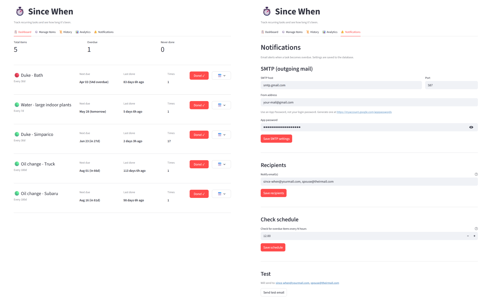

# ⏱️ Since When

A personal recurring-task tracker built with [Streamlit](https://streamlit.io). Keep a list of things you need to do regularly — washing the dog, watering plants, mowing the lawn — log when you do them, and always know how long it's been and what's overdue.

Runs as a lightweight web app in your browser. Self-host it locally, or deploy it in a Docker container on a home server, NAS (Synology, QNAP), or a Raspberry Pi so it runs continuously in the background and sends you email reminders when tasks become overdue.

## Features

- **Dashboard** — items sorted by urgency: overdue first, then nearest upcoming deadline
- **Targets** — set "must do every N days" per item; get 🟡/🔴 overdue warnings at a glance
- **Next Due** — see the calculated due date for every item on the dashboard
- **Log past dates** — start tracking something today using a date it was last done weeks ago
- **Undo** — accidentally logged something? Undo within 30 seconds
- **History** — full log of every completion, editable and deletable
- **Analytics** — interval timeline per item, on-time vs late breakdown, completions per month
- **Email notifications** — get alerted once when a task goes overdue; configurable via the UI or a plain text env file
- **Persistent storage** — all data lives in a single SQLite file, easy to back up

---


## Quickstart

```bash
# Create and activate the virtual environment (first time only)
python -m venv .venv

# Windows
.venv\Scripts\activate
# macOS / Linux
source .venv/bin/activate

# Install dependencies (first time only)
pip install -r requirements.txt

# Run the app
streamlit run app.py
```

Opens at http://localhost:8501. Data is stored in `since_when.db` (SQLite) in the same directory.

> **Tip:** VS Code will detect the `.venv` folder and offer to use it as the Python interpreter automatically.

## Status colours

| Emoji | Meaning |
|---|---|
| 🔵 | Never logged |
| 🟢 | Within target (or no target, last done < 14 days ago) |
| 🟡 | Overdue by up to 50% of target |
| 🔴 | Overdue by more than 50% of target |

## Deployment (Docker / Synology NAS)

### Files needed

```
app.py
database.py
charts.py
mailer.py
scheduler.py
requirements.txt
Dockerfile
docker-compose.yml
.dockerignore
email-notifications.env   # optional — not required if configuring via the UI
```

> **Note:** Email notifications only work reliably in Docker. When running locally
> with `streamlit run app.py`, the scheduler runs only while the app is open in
> your browser — close it and checks stop. The Docker container runs continuously
> in the background, so notifications fire regardless of whether you have the
> app open.

### 1 — Copy files to the NAS

Copy the files above to a folder on your NAS (e.g. `/volume1/docker/since-when`), via SSH, SMB share, or however you normally transfer files.

### 2 — Build and start

```bash
ssh you@nas-ip
cd /volume1/docker/since-when
mkdir -p data          # create the data folder before mounting
docker compose up -d --build
```

The first build takes a few minutes while Python and the packages download. Subsequent builds are fast.

### 3 — Access the app

```
http://nas-ip:8502
```

(Port `8502` is set in `docker-compose.yml` to avoid clashing with any other Streamlit app on `8501`.)

### Data persistence

The SQLite database is stored at `/volume1/docker/since-when/data/since_when.db` on the NAS — outside the container — so it survives rebuilds and restarts. Back it up like any other file.

### Email notifications (optional)

Configure via the **🔔 Notifications** tab in the app UI — no file editing needed.

For Docker / headless deployments, you can also set credentials in a `.env` file
(UI settings always take priority over `.env`):

```bash
nano email-notifications.env   # fill in SMTP_USER, SMTP_PASSWORD, NOTIFY_EMAIL
```

Gmail requires an **App Password** (not your login password).
Generate one at [myaccount.google.com/apppasswords](https://myaccount.google.com/apppasswords).

`NOTIFY_EMAIL` accepts comma-separated addresses for multiple recipients.

### Updating

```bash
# after copying updated files to the NAS:
docker compose up -d --build
```

### Changing the port or data path

| Setting | File | Line |
|---|---|---|
| Host port (default `8502`) | `docker-compose.yml` | `ports` |
| Data folder on NAS | `docker-compose.yml` | `volumes` (left side of `:`) |

---

## Stack

- [Streamlit](https://streamlit.io) — UI
- [SQLite](https://www.sqlite.org) (stdlib) — storage
- [Pandas](https://pandas.pydata.org) — data manipulation
- [Plotly](https://plotly.com/python/) — interactive charts
